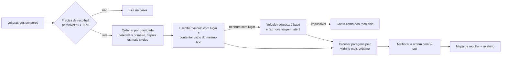

# Recolha de Bens Essenciais

Aplicação em Java que planeia as rotas diárias de recolha de uma instituição de ajuda humanitária: lê as leituras dos sensores instalados nos contentores, decide o que tem de ser recolhido e distribui o trabalho pelos veículos disponíveis.

Trabalho prático de **Paradigmas de Programação** (1.º ano da Licenciatura em Engenharia Informática, ESTG – Politécnico do Porto, 2023/24), revisto em 2026.

[](https://github.com/fmpoliveira05-jpg/recolha-bens-essenciais/actions/workflows/ci.yml)

## Contexto

Uma instituição espalhou caixas de suprimentos por uma região. Cada caixa tem vários contentores, um por tipo de bens (alimentos perecíveis, não perecíveis, roupa, medicamentos…), e cada contentor tem um sensor que comunica diariamente quantos quilos tem.

As regras do enunciado:

- um contentor é recolhido quando passa dos **80 %** da capacidade;
- **alimentos perecíveis** são recolhidos sempre, independentemente da lotação;
- os veículos saem da base com contentores vazios e **trocam-nos** pelos cheios;
- cada veículo tem um limite de contentores por tipo, e pode ser preciso fazer mais do que uma viagem;
- dados inválidos recebidos da API não podem parar o sistema: são guardados como **alertas**, com a data e o objeto em causa;
- era obrigatório usar os contratos (interfaces) fornecidos pelos docentes e **não era permitido usar a Java Collections Framework**.

## Funcionalidades

- Importação dos dados a partir de ficheiros JSON ou da Web API (as duas origens partilham o mesmo código).
- Gestão da frota (adicionar, ativar e desativar veículos), das caixas, dos contentores, das leituras e das distâncias.
- Geração do plano de recolha com o percurso de cada veículo, as trocas de contentores em cada paragem e um relatório com distâncias, tempos e contentores que ficaram por recolher.
- Histórico de mapas de recolha e registo de alertas.

## Como funciona o planeamento



Na escolha do veículo dá-se preferência a um que já vá passar nessa caixa e, a seguir, à rota onde a caixa acrescenta menos metros (inserção mais barata). Quando nenhum veículo em rota tem lugar, o que fez menos viagens volta à base e sai outra vez (no máximo 3 viagens por dia). No fim, a ordem de cada rota começa pelo vizinho mais próximo e é melhorada com **2-opt**, que inverte troços do percurso enquanto isso o encurtar.

O problema é uma variante do *Vehicle Routing Problem*, que é NP-difícil: para dezenas de caixas, garantir a solução ótima exigiria testar um número de combinações que cresce de forma explosiva. A combinação usada (construção gulosa + melhoria local) é a abordagem habitual nestes casos. Com os dados de exemplo, em relação à versão só com o vizinho mais próximo, o percurso total desce de 129,6 km para 103,3 km (−20 %), com 6 veículos em vez de 8 e os mesmos 26 contentores recolhidos.

## Arquitetura

```
src/main/java/recolha/
├── core/      modelo de domínio: instituição, caixas, contentores, leituras, distâncias
├── picking/   veículos, rotas, relatório e gerador de rotas
├── io/        importação (ficheiros ou API) através da interface DataSource
├── alerts/    registo de dados inválidos
├── util/      DynamicArray, a lista dinâmica usada em vez da JCF
└── ui/        menus da aplicação de consola
```

Algumas decisões que vale a pena explicar:

- **`DynamicArray<T>`** – como a JCF estava proibida, a versão original tinha um vetor, um contador e um método de redimensionamento em cada classe. Juntei tudo numa classe genérica, testada à parte.
- **`DataSource`** – o importador não sabe se os dados vêm de ficheiros ou da API. Antes havia duas cópias quase iguais de todo o código de leitura.
- **Identidade por código** – caixas, contentores e veículos são iguais quando têm o mesmo código (com `equals` e `hashCode` coerentes). Antes comparavam-se todos os atributos, incluindo as leituras, o que tornava as pesquisas frágeis: o mesmo contentor, com uma leitura a mais, deixava de ser considerado igual.
- **Relatórios imutáveis** – o relatório é calculado uma vez no fim do planeamento, em vez de ir sendo incrementado por vários métodos.

## Como executar

Requisitos: **Java 17** ou superior e **Maven 3.8+**.

```bash
git clone https://github.com/fmpoliveira05-jpg/recolha-bens-essenciais.git
cd recolha-bens-essenciais
mvn package                                   # compila, corre os testes e gera o .jar
java -jar target/recolha-bens-essenciais.jar  # usa os dados de exemplo da pasta data/
```

Para usar outra pasta de dados: `java -jar target/recolha-bens-essenciais.jar caminho/para/pasta`.

Um percurso rápido para ver o resultado: `1` (carregar dados) → `1` (ficheiros locais) → `5` (gerar rotas). Com os dados de exemplo são planeadas 8 rotas que recolhem 26 contentores, e ficam registados 2 alertas de leituras acima da capacidade do contentor.

O [manual de utilização](docs/MANUAL.md) explica cada menu e sugere algumas experiências.

> A Web API usada no ano letivo estava alojada no *MongoDB Atlas Data API*, serviço que foi descontinuado em 2025. A opção continua disponível (e o endereço é configurável em `HttpDataSource`), mas hoje só os ficheiros locais funcionam.

## Testes

```bash
mvn test
```

43 testes JUnit 5 cobrem a lista dinâmica, as regras dos contentores e das leituras, as operações da instituição, a edição de rotas, o cálculo de distâncias (base → caixas → base), o gerador de rotas em cenários pequenos construídos à medida e a otimização 2-opt (que tem de encontrar o percurso ótimo num caso conhecido). O importador é testado com os ficheiros reais e com documentos JSON inválidos. O GitHub Actions corre tudo em cada *push*.

## O que mudou na revisão de 2026

A versão entregue compilava e passava nas demonstrações, mas uma revisão cuidada encontrou vários erros:

- a validação de tipos repetidos ao adicionar uma caixa só comparava contentores vizinhos e lia uma posição fora do vetor (só não rebentava porque, na importação, os contentores ainda não tinham tipo nesse momento);
- várias listas eram devolvidas com posições `null` no fim ou expunham o vetor interno;
- a distância total de uma rota era somada outra vez a cada chamada;
- cada rota só podia ter uma caixa, e o número de rotas dependia da capacidade interna dos vetores, pelo que algumas ficavam associadas a um veículo `null`;
- a verificação de tipo repetido numa caixa comparava referências (`==`) em vez de usar `equals`;
- `equals` sem `hashCode` em todas as classes de domínio;
- os alertas eram criados mas nunca guardados em lado nenhum;
- no menu principal faltava um `break`, e a opção "distâncias" executava também a geração de rotas;
- leituras de 0 kg (contentor vazio) eram rejeitadas.

Além das correções, o projeto passou de NetBeans/Ant para Maven, ganhou testes automáticos e o código duplicado (menus, importação, redimensionamento de vetores) foi reorganizado.

## Nota sobre as dependências

A pasta `lib/maven-repo` contém apenas as interfaces e exceções (`com.estg.*`) disponibilizadas pelos docentes da unidade curricular, de uso obrigatório no trabalho. Esse código pertence aos seus autores; a licença MIT deste repositório aplica-se ao resto do código.

## Autor

**Francisco Miguel Pereira Oliveira** – [GitHub](https://github.com/fmpoliveira05-jpg)
